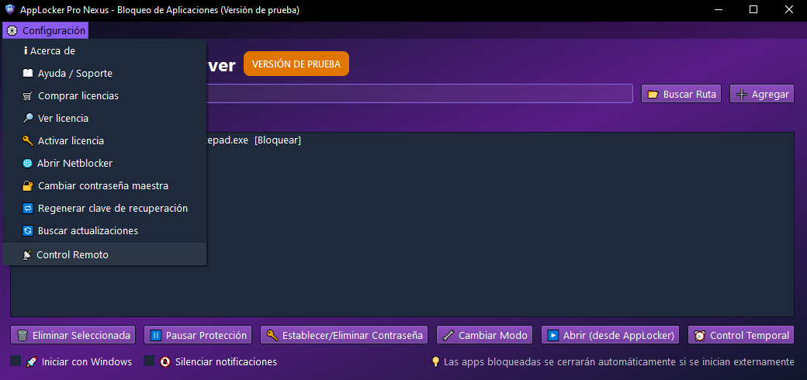
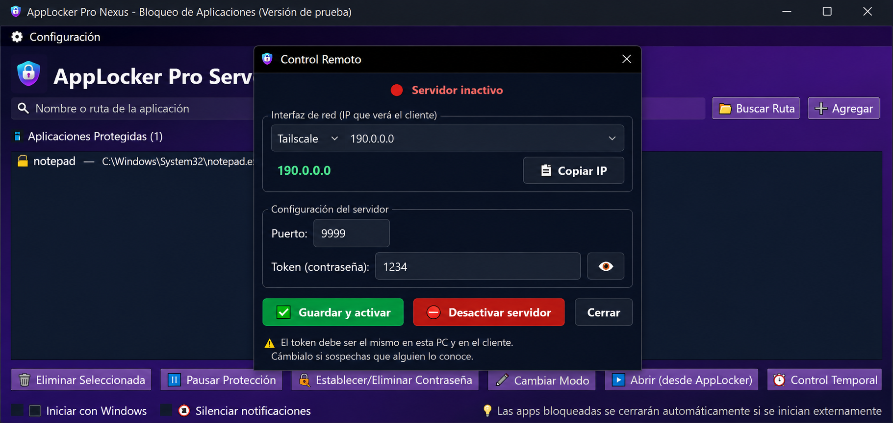
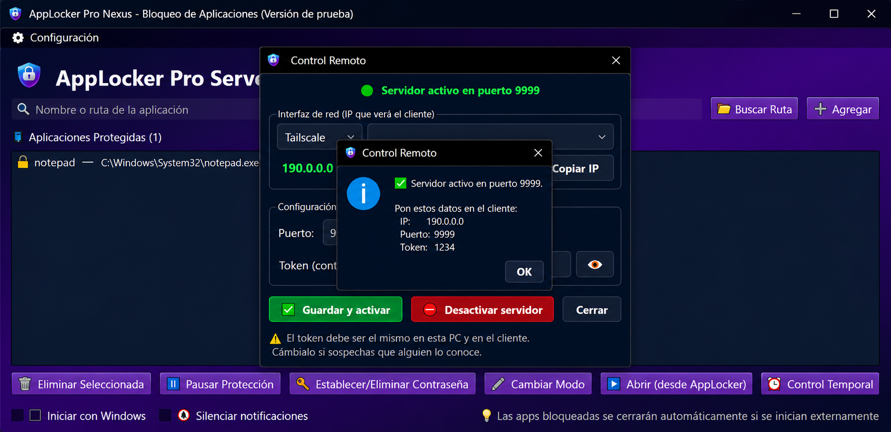
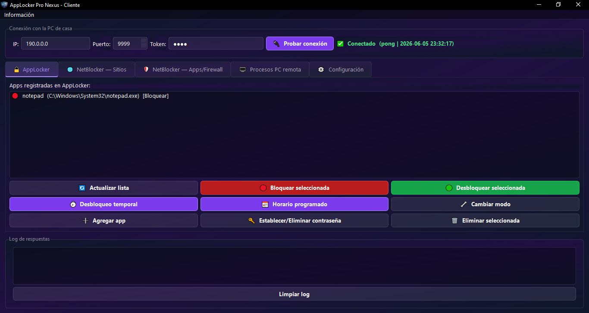

# 📡 Cómo Conectar AppLocker Pro Suite (Host + Cliente)

> **AppLocker Pro Suite** funciona en dos partes:
> - 🖥️ **AppLocker Host (Servidor)** — se instala en la PC que quieres controlar
> - 💻 **AppLocker Cliente** — se usa en tu PC para controlar la PC remota

---

## ❓ ¿Por qué necesito Tailscale?

Cuando dos PCs están en **redes distintas** (casa vs. trabajo, por ejemplo), no pueden comunicarse directamente usando la IP local porque:

- Las IPs locales (`192.168.x.x`) **solo funcionan dentro de la misma red**
- Las IPs públicas suelen ser **dinámicas** (cambian cada cierto tiempo)
- Abrir puertos en el router es complicado y no siempre es posible

**Tailscale resuelve todo esto** creando una red privada virtual (VPN) entre tus dispositivos. Cada PC recibe una IP fija que **nunca cambia**, sin importar dónde estén ni qué red usen.

---

## 🚀 Paso 1 — Instalar Tailscale en AMBAS PCs

1. Ve a 👉 **[https://tailscale.com/download](https://tailscale.com/download)**
2. Descarga e instala Tailscale en **la PC remota (Host)** y en **tu PC (Cliente)**
3. En cada PC, abre Tailscale y **inicia sesión** con la misma cuenta (Google, Microsoft o correo)

> ⚠️ **Importante:** Ambas PCs deben iniciar sesión con **la misma cuenta de Tailscale** para que puedan verse entre sí.

---

## ⚙️ Paso 2 — Configurar AppLocker Host (PC remota)

En la PC remota, abre AppLocker y ve al menú **⚙ Configuración → 📡 Control Remoto**:



Se abrirá la ventana de Control Remoto:



Configura los siguientes campos:

| Campo | Qué poner |
|-------|-----------|
| **Interfaz de red** | Selecciona la línea que muestre **Tailscale → 190.0.0.0** (la IP que empieza con `100.`) |
| **Puerto** | Déjalo en `9999` (o elige otro si prefieres) |
| **Token** | Escribe una contraseña secreta (ej: `miClave2025`) |

> 🔴 **MUY IMPORTANTE:** El **Token (contraseña)** y el **Puerto** que pongas aquí deben ser **exactamente iguales** en el Cliente. Si no coinciden, la conexión fallará.

Presiona **✅ Guardar y activar**. Verás una confirmación con los datos para el cliente:



> 💡 Anota o copia la IP, Puerto y Token que se muestran — los necesitarás en el Cliente.

---

## 💻 Paso 3 — Configurar ALP Cliente (tu PC)

Abre ALP Cliente en tu PC. En la barra superior ingresa los datos que obtuviste del Host:



| Campo | Qué poner |
|-------|-----------|
| **IP** | La IP de Tailscale de la PC remota (la que viste en el Host, ej: `190.0.0.0`) |
| **Puerto** | El mismo que configuraste en el Host (ej: `9999`) |
| **Token** | La misma contraseña que pusiste en el Host (ej: `miClave2025`) |

Presiona **🔌 Probar conexión** — si todo está correcto verás:

```
✅ Conectado  (pong | 2026-01-01 12:00:00)
```

---

## ✅ ¡Listo! Ya puedes controlar la PC remota

Una vez conectado podrás desde el Cliente:

- 🔒 Bloquear y desbloquear aplicaciones remotamente
- ⏰ Configurar desbloqueos temporales y horarios programados
- 🌐 Gestionar sitios bloqueados con NetBlocker
- 🖥️ Ver y finalizar procesos activos en la PC remota
- 👁️ Ocultar/mostrar el ícono de AppLocker en la bandeja
- 🔑 Activar licencias remotamente sin tocar la PC remota
- 🔄 Actualizar el servidor en segundo plano

---

## 🔄 Resumen rápido

```
PC Remota (Host)                         Tu PC (Cliente)
────────────────────────                 ──────────────────────
1. Instalar Tailscale               ←→   1. Instalar Tailscale
2. Anotar IP Tailscale                   2. Abrir ALP Cliente
   (ej: 190.0.0.0)                       3. Ingresar:
3. Abrir AppLocker                          IP:     190.0.0.0
4. Configuración → Control Remoto          Puerto: 9999
5. Seleccionar IP Tailscale                Token:  miClave2025
6. Puerto: 9999                          4. Probar conexión ✅
7. Token:  miClave2025
8. Guardar y activar ✅
```

---

## ❗ Solución de problemas

| Problema | Solución |
|----------|----------|
| ❌ "Conexión rechazada" | Verifica que AppLocker Host esté activo y el servidor activado |
| ❌ "Timeout" | Verifica que Tailscale esté conectado en ambas PCs |
| ❌ "Token inválido" | El token no coincide — debe ser exactamente igual en ambas apps |
| ❌ No aparece IP Tailscale | Asegúrate de haber iniciado sesión en Tailscale con la misma cuenta |
| ❌ "Trial expirado" | Activa una licencia en AppLocker desde Cliente → ⚙ Configuración → 🔑 Licencia |

---

## 🔒 ¿Es seguro?

Sí. La comunicación está protegida por:

- **Tailscale** cifra todo el tráfico con WireGuard (protocolo VPN moderno y seguro)
- **El Token** actúa como contraseña adicional — nadie puede conectarse sin conocerlo
- **La carpeta de configuración** está oculta en el sistema

---

## ¿Necesitas ayuda?

Si tienes problemas con la configuración o alguna duda, contáctanos:

- 💬 **Telegram:** [@soporteantimalware](https://t.me/soporteantimalware)
- 📧 **Correo:** soporteantimalware@gmail.com

---

*Tutorial para AppLocker Pro Nexus*
